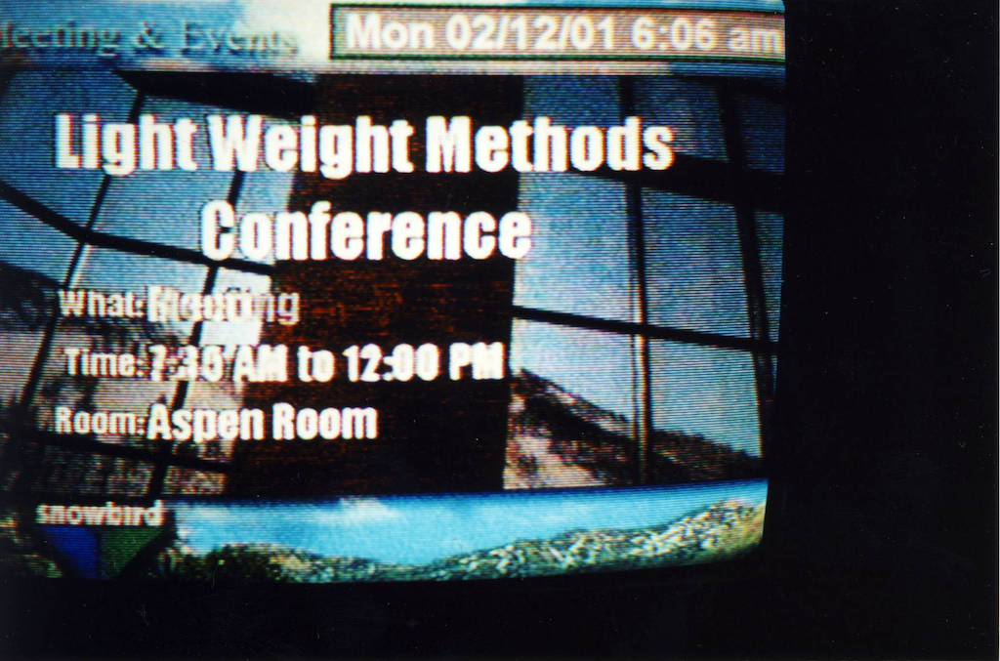
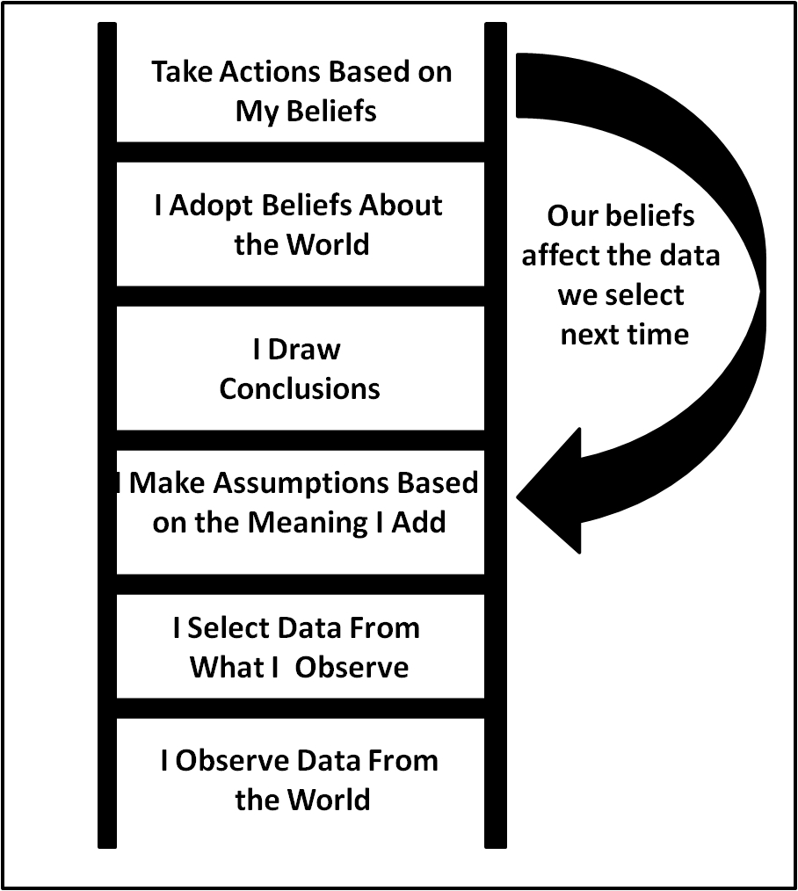
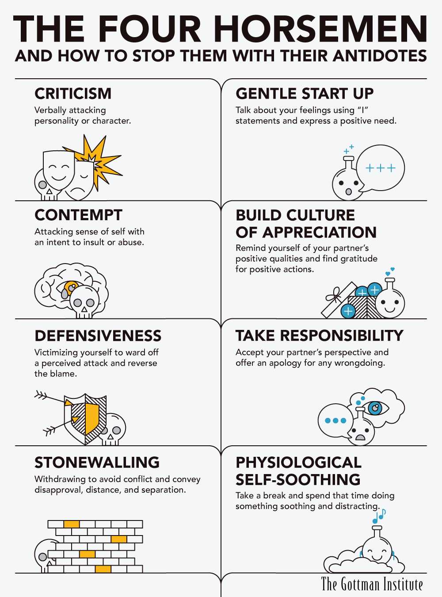

# AgileIndy 2019
*April 26th, 2019*  
Indianapolis

## Morning Keynote: Business Agility, what else?
with [Arie Van Bennekum](https://twitter.com/arievanbennekum)

On the cost of delay: "If you're late? Don't worry, your competition will be on time."

50% of the cost of a software system is due to misunderstanding.

A picture is worth a thousand words, and yet we keep writing documentation!

Paradigms define our reflexes under stress.

## Afternoon Keynote: Personal Agility

with [Maria Matarelli](https://twitter.com/MariaMatarelli)

### What Really Matters?

**Satir Change Model**  
Status Quo ->  
Foreign Element ->  
Chaos ->  
Transforming Idea ->   
New Status Quo

**Direction** is more important than **Speed**.

### Personal Agility

Columns:  
**What Really Matters?** Up to 4 major life themes  
**What is Important?** Possibilities for advancing what matters  
**What is Urgent?** Something bad might happen if these don't get done  
**Done this Week**  
**Done Done** (Journal what actually happened, planned and unplanned--visibility!)

Promoted [mypersonalagility.org](https://mypersonalagility.org)

## Value stream maps: the secret weapon

with [Chris Daily](https://twitter.com/Chris_Daily) and Michael Denk

\#slinkythink

**Lean**  
Continuously deliver value, improve, and eliminate waste

**Gemba Walk**  
"Go to where the work is done"
Managers walk the production floor to observe and engage with the workers

A **value stream** is all of the steps that it takes to produce something of value. A **value stream map** is a flowchart of a value stream. 

- **Boxes** represent tasks or milestones
- **Diamonds** represent decision points
- **Arrows** between these indicate flow
- Must have clear **start** and **end** points

Add **metrics** to map elements to see their impact on the value stream.

Lead Time  
[Value Add Time](https://www.myaccountingcourse.com/accounting-dictionary/value-added-time)  
% Complete/Accurate  

Don't introduce metrics you don't need to improve the flow--that would be adding waste.

## Scrum Masters, Let’s Get Technical!

with [Marcy Elhamidi](https://twitter.com/MarcyElhamidi)

##### The Problem
Non-technical Scrum Masters have difficulty communicating with and leading a team of nerds.

Find **champions**--developers who are fanatic about something (TDD, Pipelines, Database, etc.)--and build your teams around them. Get them to lead and teach others.

Read software development books (e.g., *Refactoring*, *Clean Code*, *Extreme Programming Explained*), blogs, and listen to podcasts

Learn about Extreme Programming--the technical side of agility!

Don't just assume that the developers you're working with truly understand concepts like iterative development, TDD, and CI/CD.

Assess your team based on a CI/CD maturity model

Get developers to come prepared for backlog refinement meetings--indicate the stories to be discussed ahead of time, and have them look at the code involved before the meeting.

## Fakes & Bullies: Taming your impostor syndrome to find your inner thought leader

with [Kat Daugherty](https://www.linkedin.com/in/kat-daugherty)

### Shu (How to spot an Agile Bully)
#### Faces of Imposter Syndrome
from Valerie Young's [The Secret Thoughts of Successful Women](https://www.amazon.com/Secret-Thoughts-Successful-Women-Impostor/dp/0307452719)

**Perfectionist**. Setbacks crush my self-worth because people expect me to be good at things. I may avoid trying things because I might fail.

**Soloist**. I hesitate to ask for help or work with others, because it might appear I don't have the right skills.

**Expert**. I feel self-conscious when someone calls me an expert.

**Natural Born Genius**. I feel ashamed when it takes me a long time to learn something no matter how difficult or complex.

**Superhero**. I feel guilty whenever I'm not working. I struggle to find work-life balance.

### Ha (How not to be an Agile Bully)
An agile bully might actually just have been excited to share an idea, not intending to do harm.

**Radical Hero**. The persona that cheers you on, who counteracts your imposter syndrome. Strengthen this part of you by *being a Radical Hero for other people*!

#### Ladder of Inference

In response to a disagreement, ask what information the other person has that you don't.

**5:1**. Ask for feedback 5x more often than you offer suggestions.

#### Gottman's Four Horsemen

Empathy is the key to all of this. **And you only get it by giving it**.

Agile is about a new way to work where we actually respect each other.

**Work by Invitation**  
[No MAS (Meeting Acceptance Syndrome)](https://www.ted.com/talks/david_grady_how_to_save_the_world_or_at_least_yourself_from_bad_meetings)  
Make all meetings optional!

### Ri (Thought Leadership)

It's not about me, and there is no BAD or WRONG Agile.

**Thought Leadership**  
I learned something  
I tried something  
I shared something  

Thought and Servant Leadership are related

"Champion" vs. "Mentor"

When sharing an idea, frame it in your experience and your humility (not as an absolute).